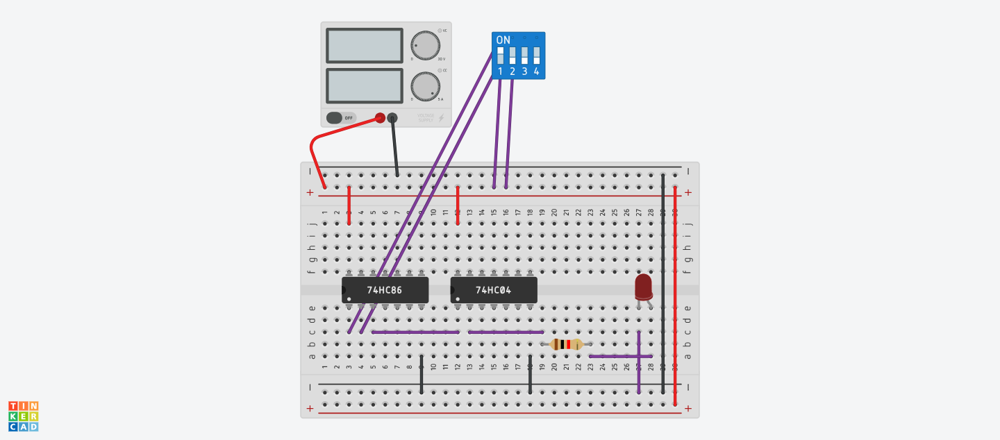

# Parity Odd Circuit – Tinkercad Project

This is a simple digital logic circuit built in [Tinkercad](https://www.tinkercad.com/) to detect **odd parity** using logic gates.

## 🔧 Components Used
- 74HC86 (Quad XOR Gate)
- 74HC04 (Hex Inverter/NOT Gate)
- DIP Switch SPST x 4
- Red LED
- Breadboard
- Jumper wires
- Resistor (1 kΩ)
- Power Supply (5V)

## ⚙️ Working Principle

- **Parity checking** ensures the number of 1s in a binary input follows a specified rule (even or odd).
- This circuit implements **odd parity** logic.
- When the number of 1s in the 4-bit DIP switch input is **odd**, the LED turns ON.
- When the number of 1s is **even**, the LED stays OFF.

### XOR Gate Logic for Parity:
- `XOR(A, B) = 1` when A ≠ B
- Chaining XOR gates: `A ⊕ B ⊕ C ⊕ D` gives 1 if the number of 1s is odd.

## 🖼️ Circuit Image

> Screenshot of the Tinkercad breadboard setup with logic ICs and DIP switch.

## 🧠 Truth Table Example

| DIP Switch Input | No. of 1s | Output (LED) |
|------------------|-----------|--------------|
| 0000             | 0         | OFF          |
| 0001             | 1         | ON           |
| 0011             | 2         | OFF          |
| 0111             | 3         | ON           |
| 1111             | 4         | OFF          |

## 🧪 Simulation

You can simulate this logic circuit in **Tinkercad Circuits** to observe real-time behavior by toggling the DIP switches and watching the LED output.

## 📌 Created with
- Tinkercad Circuits

## 📁 File Info
This repository contains the screenshot of the circuit and the circuit explanation. The Tinkercad project can be accessed online if shared.

## 🔗 Tinkercad Project Link
👉 https://www.tinkercad.com/things/7ISXCg6tA80-parity-odd?sharecode=KhqXKX1domJ2sVBAQeDfubeZ43saSa_7tlg7pAA-FNw

